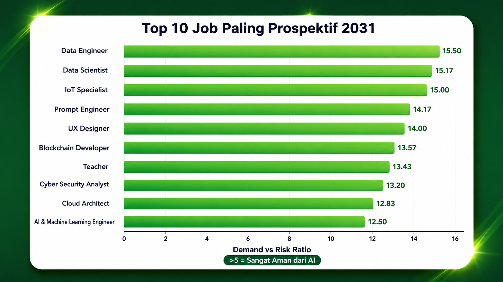

## Visualisasi

### Top 10 Job Paling Prospektif 2031
Chart berdasarkan `Demand_Risk_Ratio = Future_Demand_Score / AI_Replacement_Risk`. 
Skor >5 artinya job aman dari otomasi AI dan demand tinggi.

### 🚀 Live Dashboard

[[🚀 Hugging Face Spaces - Live Dashboard](https://img.shields.io/badge/🤗_Hugging_Face-Spaces_🚀-FFD21E?style=for-the-badge&logo=huggingface)](https://huggingface.co/spaces/farone11/ai-jobs-2031-dashboard)

Dashboard interaktif by **Farly Setiawan, Specialist Data Engineer**

Explore 3000+ jobs, filter by AI risk, salary, dan industry untuk tahun 2031.

[Original Dataset](AI_Impact_on_Jobs_2031.csv)

# AI-Impact-on-Jobs-2031
Dataset prediksi dampak AI terhadap pasar kerja global 2031. 3000 records, 20 features. MIT License

# AI Impact on Jobs 2031 Dataset
Dataset prediksi dampak AI terhadap pasar kerja global tahun 2031.

## Isi Dataset
- **3000 records** dengan 20 kolom
- Kolom utama: `Job_Title`, `Industry`, `Country`, `AI_Replacement_Risk`, `Future_Demand_Score`, `Average_Salary_USD`
- Mencakup data risk otomasi, demand masa depan, dan trend hiring 2026

## Kegunaan
1. Exploratory Data Analysis tentang future of work
2. Visualisasi job yang tumbuh vs hilang karena AI  
3. Training model prediksi AI replacement risk

## Lisensi
MIT License - bebas dipake, modifikasi, komersial. Lihat file `LICENSE`.

## Kontak
farone2013@gmail.com/Setiawan farly
